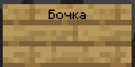

# Сборка и Ресурспак

## Установка нашей сборки!

1. Устанавливаем[ <mark style="color:purple;">**FabricMC**</mark>](../dopolnitelnye-mody/start-moddinga.md) или [<mark style="color:purple;">**QuiltMC**</mark>](../dopolnitelnye-mody/start-moddinga.md)<mark style="color:purple;">****</mark>
2. Скачиваем сборку с **Google Drive** - [<mark style="color:purple;">**ссылка**</mark>](https://drive.google.com/file/d/1-oyhcED9VzlPAZNSz\_xuwHV62GuyG4XG/view?usp=sharing)<mark style="color:purple;">****</mark>
3. В архиве есть папка **.minecraft**
4. Кидаем эту папку в **.appdata/roaming. Эта папка зависит от лаунчера!!!**
5. Выбираем в нашем лаунчере пункт **Fabric** и **запускаем его.**
6. В меню игры должна появиться кнопка **Mods/Моды**
7. **Установка прошла успешно!**

## Установка нашего ресурспака!

> Для этого нужно иметь проходку!

### Скачивание Ресурспака из Дискорда

1. Заходим в Дискорд и переходим по этой [<mark style="color:purple;">**ссылке**</mark>](https://discord.com/channels/1001529558232731729/1008474486452007072/1069648788785999872)<mark style="color:purple;">****</mark>
2. Находим в этом сообщении пункт с **Нашим ресурспаком**

<figure><figcaption>
Пункт в Дискорде.
</figcaption></figure>

### Установка Ресурспака в Майнкрафт

1. У нас есть **Архив с Ресурспаком.**
2. Кидаем этот Архив в <mark style="color:purple;">**.minecraft\resourcepacks**</mark>
3. Заходим в **Майнкрафт**
4. Заходим в **Настройки** -> **Ресурспаки**
5. Видим наш Ресурспак и включаем его.
6.  **Ресурспак установлен!**

    <figure><figcaption>
Как выглядит в Меню ресурспаков.
</figcaption></figure>

