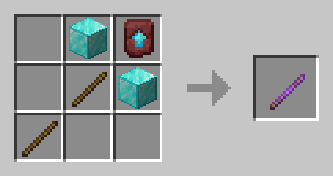

# Мелкие плагины

## Кастомные рецепты

.png>)  (1).png>)

<figure><figcaption>
Крафт <mark style="color:red;">Мешка</mark>
</figcaption></figure>

 

<figure><figcaption>
Крафт Редактора <mark style="color:red;">ItemDisplay</mark>
</figcaption></figure>

## Позы Арморстендов

Чтобы вызвать меню <mark style="color:red;">Редактора Арморстенда</mark>, возьмите Кремень и кликните ПКМ по **Арморстенду**.
